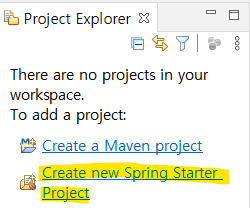
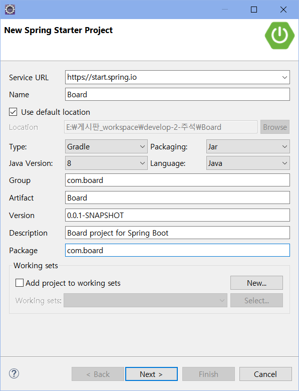
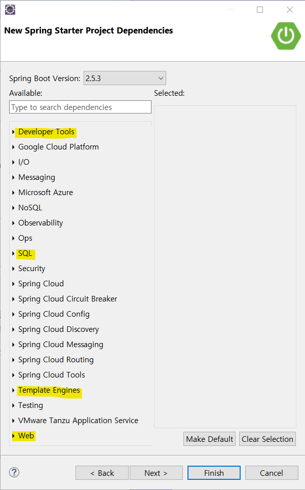
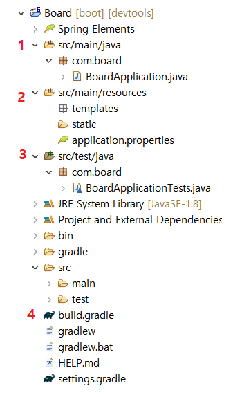

# [Spring Boot 게시판 - 01. 개발환경 설정]

### 개발 환경

- 화면 처리는 JSP를 대신하여 HTML5 기반의 자바 템플릿 엔진인 타임리프(Thymeleaf) 사용
- 프로젝트의 각 설정은 XML 설정을 대신하여 JAVA 기반의 설정 사용
- 데이터베이스: MySQL
- 프레임워크: MyBatis

---

### 1. 자바(JAVA) JDK 설치

1) [**JDK 다운로드**](https://www.oracle.com/java/technologies/javase/javase-jdk8-downloads.html)에서 PC의 운영체제와 일치하는 파일 설치

2) 환경 변수 추가 

- JAVA_HOME: JDK 경로

- CLASSPATH: %JAVA_HOME%\lib

- Path: %JAVA_HOME%\bin (가장 상단으로 이동)

   

### 2. IDE(STS) 설치

1) [**STS 다운로드**](https://spring.io/tools)에서 PC의 운영체제와 일치하는 파일 설치

2) 다운로드 - jar파일 실행

3) develop 폴더 생성 - 설치된 sts 폴더를 develop 폴더 하위로 이동 (경로: C:\develop\sts-4.5.1.RELEASE)

4) deveop 폴더 안에 workspace 폴더 생성

 

### 3. 프로젝트 생성

- Create new Spring Starter Project 클릭

- 프로젝트 생성

- Developer Tools, SQL, Template Engines, Web 항목 선택

- Developer Tools
  - Spring Boot DevTools
  - Lombok
  - Spring Configuration Processor

- SQL
  - Spring Data JPA
  - MyBatis Framework
  - MySQL Driver
- Template Engines
  - Thymeleaf
- Web
  - Spring Web

 

### 4. 필수 플러그인 설치

화면 상단의 Help - Eclipse Marketplace - mybatis 1.2.4 설치

---

# [프로젝트 구조 알아보기]

### - MVC 패턴

| 패턴          | 설명                                                         |
| ------------- | ------------------------------------------------------------ |
| Model(M)      | 데이터를 처리하는 영역으로, 흔히 비즈니스 로직을 처리하는 영역이라고 한다.  데이터베이스와 통신하고, 사용자가 원하는 데이터를 가공하는 역할을 한다. |
| View(V)       | 사용자가 보는 화면을 의미 HTML과 타임리프를 사용하여 화면을 처리한다. |
| Controller(C) | 모델과 뷰 영역의 중간다리 역할 사용자가 웹에서 어떠한 요청을 하면 가장 먼저 컨트롤러를 경유한다.  컨트롤러는 사용자의 요청을 처리할 어떠한 로직을 호출하고, 호출한 결과를 사용자에게 전달하는 역할을 한다.  ex) 사용자가 게시판에 게시글 작성하고 등록 요청 -> 컨트롤러는 게시글의 제목, 내용, 작성자 등에 해당하는 파라미터(데이터)를 전달받아 유효성을 검증 -> 검증이 완료되면 모델 영역에 데이터의 가공을 요청 -> 가공이 완료되면 데이터베이스에 데이터 저장 -> 저장의 성공/실패 여부를 컨트롤러로 전달 -> 등록 요청에 대한 결과를 뷰로 전달 |

### - 프로젝트 구조

### 1. src/main/java 디렉터리

- 클래스, 인터페이스 등 자바 파일이 위치

- BoardApplication 클래스
  - main 메서드: SpringApplication.run 메서드를 호출하여 웹 어플리케이션을 실행하는 역할

  | annotation               | 설명                                                         |
  | ------------------------ | ------------------------------------------------------------ |
  | @EnableAutoConfiguration | 스프링 부트는 개발에 필요한 몇 가지 필수적인 설정들의 처리가 되어 있는데, 해당 애너테이션에 의해 다양한 설정들의 일부가 자동으로 완료된다. |
  | @ComponentScan           | 기존의 XML 설정 방식의 스프링은 빈(Bean)의 등록 및 스캔을 위해 수동으로 ComponentScan을 여러 개 선언하는 방식을 사용하였다. 스프링 부트는 해당 애너테이션에 의해 자동으로 컴포넌트 클래스를 검색하고, 스프링 애플리케이션 콘텍스트(IoC 컨테이너)에 빈(Bean)으로 등록한다. 쉽게 이야기하면, 의존성 주입 과정이 더욱 간편해졌다고 생각할 수 있다. |
  | @Configuration           | 해당 애너테이션이 선언된 클래스는 자바 기반의 설정 파일로 인식된다. 스프링 4 버전부터 자바 기반의 설정이 가능하게 되었으며, XML 설정에 어마 무시한 시간을 소모하지 않아도 된다. 물론, XML 기반의 설정을 전혀 사용하지 않는 것은 아니다. |

### 2. src/main/resources 디렉터리

- 스프링부트에서는 templates, static 폴더와 application.properties 파일이 기본 생성됨

| 폴더/파일              | 설명                                                         |
| ---------------------- | ------------------------------------------------------------ |
| templates              | 스프링 부트는 src/main/resources 디렉터리 내에서 화면과 관련된 파일을 관리하는 것으로 생각할 수 있습니다. 스프링 부트는 타임리프(Thymeleaf) 템플릿 엔진의 사용을 권장하는데요, 타임리프는 JSP와 마찬가지로 HTML 내에서 데이터를 처리하는 데 사용됩니다. |
| static                 | 해당 폴더에는 css, fonts, images, plugin, scripts 등의 정적 리소스 파일이 위치합니다. |
| application.properties | 해당 파일은 웹 애플리케이션을 실행하면서 자동으로 로딩되는 파일입니다. 예를 들어 톰캣(Tomcat)과 같은 WAS(포트 번호, 콘텍스트 패스 등)의 설정이나, 데이터베이스 관련 정보 등 각각으로 분리되어 있는 XML 또는 자바 기반의 설정을 해당 파일에 Key-Value 형식으로 지정해서 처리할 수 있습니다. |

### 3. src/test/java 디렉터리

- com.board 패키지에는 BoardApplicationTests 클래스가 생성되어 있음
- 해당 클래스를 이용하여 각 개발 단계에 알맞은 테스트를 진행할 수 있다. 

### 4. build.gradle

- Gradle
  - 메이븐(Maven)
    - pom.xml에 여러 개의 dependency를 추가하여 라이브러리를 관리하는 방식
    - 라이브러리의 버전 문제, 충돌 문제, 종속적인 문제 등 
  - 메이븐의 이러한 문제 때문에 최근에는 그레이들을 선호하는 추세

