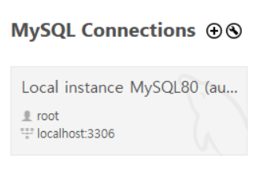
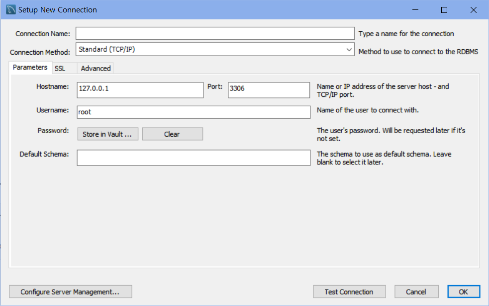
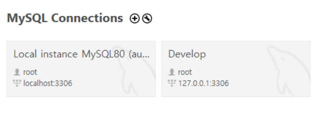
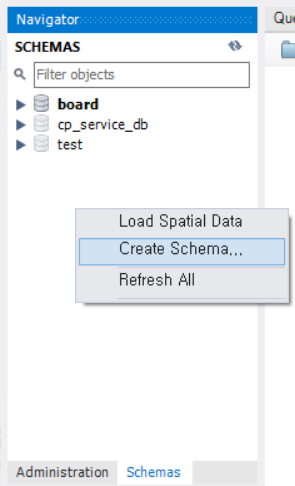
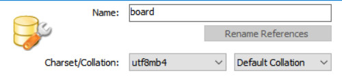
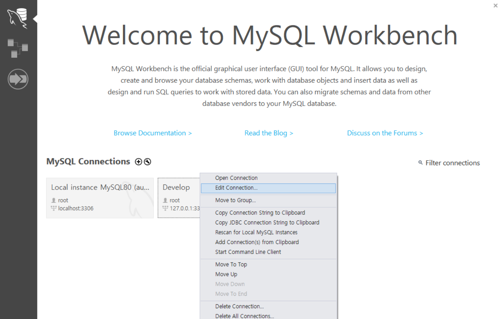
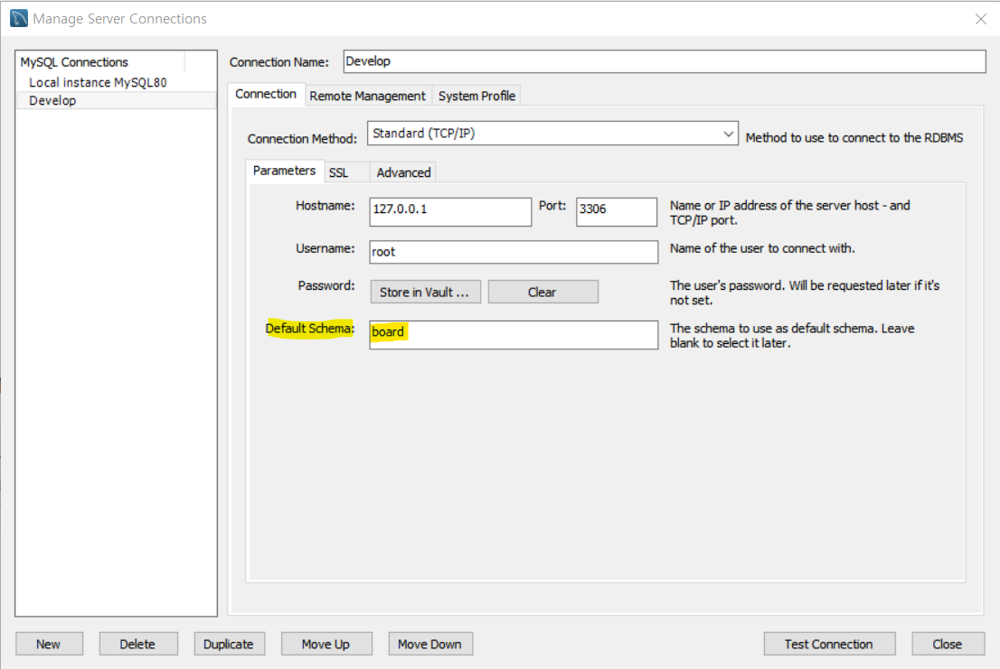
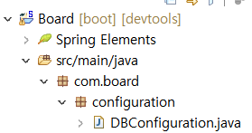
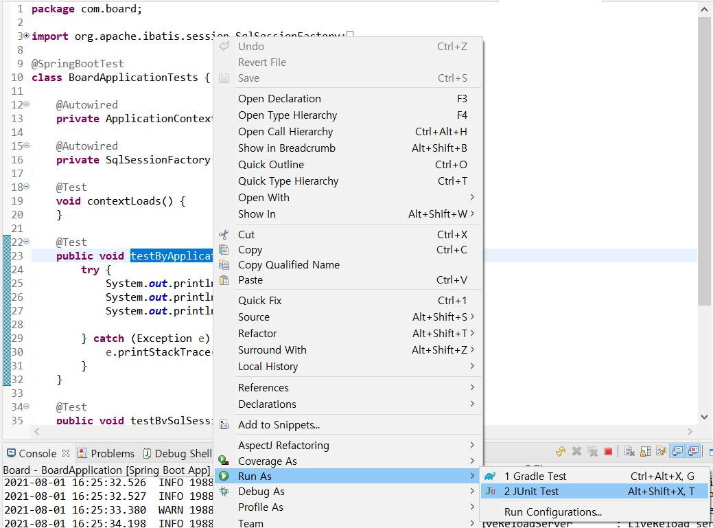

# [Spring Boot 게시판 - 02. MySQL(HikariCP) 연동]

- 사전 설치
  - DB: MySQL
  - GUI: MySQL Workbench

---

### 1. 커넥션 생성

- MySQL Workbench 실행 - 상단의 (+) 클릭

  

- MySQL Workbench 커넥션 생성 화면




| 파라미터       | 설명                                                         |
| -------------- | ------------------------------------------------------------ |
| Hostname       | 데이터베이스를 연결할 주소<br />Hostname에는 localhost 또는 127.0.0.1 입력해야 한다. |
| Port           | MySQL의 기본 포트번호: 3306                                  |
| username       | MySQL 설치 과정에서 입력한 아이디                            |
| Password       | MySQL 설치 과정에서 입력한 패스워드                          |
| Default Schema | 기본적으로 사용할 스키마(Schema)                             |


- 커넥션 생성 결과



<br>

---

### 2. MySQL 스키마 생성하기

- 좌측 중앙의 Schemas 선택 - 상단의 SCHEMAS 영역의 빈 공간에서 마우스 오른쪽 버튼 클릭 - Create Schema 선택




- 스키마 생성 

  


- 데이터베이스에서 사용하고 싶은 스키마 지정 방법

  - SCHEMAS 에서 스키마 더블 클릭

  - SQL 입력 창에 다음과 같이 입력

    ```sql
    USE 스키마 이름;
    ```

  - Default Schema 지정하면 매번 커넥션 오픈 시 지정하는 작업 생략 가능 

    - 지정 방법: 홈 화면에서 Edit Connection 클릭

      

      

    - default schema 지정

      

<br>

---

### 3. 데이터 소스(DataSource) 설정하기

- 스프링 부트에서 데이터 소스의 설정은 두 가지 방법 사용 가능
  - `@Bean` 애너테이션 이용
  - application.properties 파일 이용

- application.properties 파일 이용하는 방법

  - src/main/resources/application.properties

    ```sql
    spring.datasource.hikari.driver-class-name=com.mysql.cj.jdbc.Driver
    spring.datasource.hikari.jdbc-url=jdbc:mysql://localhost:3306/board?serverTimezone=UTC&useUnicode=true&characterEncoding=utf8&useSSL=false
    spring.datasource.hikari.username=MySQL 아이디
    spring.datasource.hikari.password=MySQL 비밀번호
    spring.datasource.hikari.connection-test-query=SELECT NOW() FROM dual
    ```

<br>

---

### 4. 패키지 & 클래스 추가하기

- src/main/java - com.board 패키지에 configuration 패키지 추가

- configuration 패키지 - DBConfiguration 클래스 생성

  

- DBConfiguration.java

  ```java
  package com.board.configuration;
  
  import javax.sql.DataSource;
  
  import org.apache.ibatis.session.SqlSessionFactory;
  import org.mybatis.spring.SqlSessionFactoryBean;
  import org.mybatis.spring.SqlSessionTemplate;
  import org.springframework.beans.factory.annotation.Autowired;
  import org.springframework.boot.context.properties.ConfigurationProperties;
  import org.springframework.context.ApplicationContext;
  import org.springframework.context.annotation.Bean;
  import org.springframework.context.annotation.Configuration;
  import org.springframework.context.annotation.PropertySource;
  
  import com.zaxxer.hikari.HikariConfig;
  import com.zaxxer.hikari.HikariDataSource;
  
  @Configuration
  @PropertySource("classpath:/application.properties")
  public class DBConfiguration {
  
  	@Autowired
  	private ApplicationContext applicationContext;
  
  	@Bean
  	@ConfigurationProperties(prefix = "spring.datasource.hikari")
  	public HikariConfig hikariConfig() {
  		return new HikariConfig();
  	}
  
  	@Bean
  	public DataSource dataSource() {
  		return new HikariDataSource(hikariConfig());
  	}
  
  	@Bean
  	public SqlSessionFactory sqlSessionFactory() throws Exception {
  		SqlSessionFactoryBean factoryBean = new SqlSessionFactoryBean();
  		factoryBean.setDataSource(dataSource());
  //		factoryBean.setMapperLocations(applicationContext.getResources("classpath:/mappers/**/*Mapper.xml"));
  		return factoryBean.getObject();
  	}
  
  	@Bean
  	public SqlSessionTemplate sqlSession() throws Exception {
  		return new SqlSessionTemplate(sqlSessionFactory());
  	}
  }
  ```

  | Annotation               | 설명                                                         |
  | ------------------------ | ------------------------------------------------------------ |
  | @Configuration           | 스프링은 @Configuration이 지정된 클래스를 자바 기반의 설정 파일로 인식한다. |
  | @PropertySource          | 해당 클래스에서 참조할 properties 파일의 위치를 지정한다.    |
  | @Autowired               | 빈(Bean)으로 등록된 인스턴스(이하 객체)를 클래스에 주입하는 데 사용한다.<br />@Autowired 이외에도 @Resource, @Inject 등이 존재한다. |
  | ApplicationContext       | - ApplicationContext: **스프링 컨테이너(Spring Container)** 중 하나<br />- 스프링 컨테이너: **빈(Bean)의 생성과 사용, 관계, 생명 주기 등을 관리**한다.<br />- 빈(Bean): 객체<br />프로젝트에 100개의 클래스가 있다고 가정하자. 100개의 클래스 간의 의존적인 문제가 많으면 **"결합도가 높다"**라고 표현하는데, 이러한 문제를 컨테이너에서 빈(Bean)을 주입받는 방법으로 해결할 수 있다. |
  | @Bean                    | Configuration 클래스의 메서드 레벨에만 지정이 가능하며, @Bean이 지정된 객체는 컨테이너에 의해 관리되는 빈(Bean)으로 등록된다. |
  | @ConfigurationProperties | 해당 애너테이션은 인자에 **prefix**속성을 지정할 수 있다.<br />우리는 prefix에 spring.datasource.hikari를 지정하였는데, 쉽게 이야기하면 @PropertySource에 지정된 파일(application.properties)에서 prefix에 해당하는 **spring.datasource.hikari**로 시작하는 설정을 모두 읽어 들여 해당 메서드에 매핑(바인딩)한다. <br />추가적으로 해당 애너테이션은 메서드뿐만 아니라 클래스 레벨에도 지정할 수 있다. |
  | hikariConfig             | 히카리CP 객체를 생성 <br />히카리CP는 **커넥션 풀(Connection Pool) 라이브러리** 중 하나 |
  | dataSource               | 데이터 소스 객체를 생성. 커넥션 풀을 지원하기 위한 인터페이스<br />순수 JDBC는 SQL을 실행할 때마다 커넥션을 맺고 끊는 I/O 작업을 하는데, 이러한 작업은 상당한 리소스를 잡아먹는다. 이러한 문제의 해결책이 **커넥션 풀**<br />커넥션 풀은 커넥션 객체를 생성해두고, 데이터베이스에 접근하는 사용자에게 미리 생성해둔 커넥션을 제공했다가 다시 돌려받는 방법 |
  | sqlSessionFactory        | SqlSessionFactory 객체를 생성<br />SqlSessionFactory는 데이터베이스의 커넥션과 SQL 실행에 대한 모든 것을 갖는 정말 중요한 역할<br />**SqlSessionFactoryBean**은 마이바티스와 스프링의 연동 모듈로 사용되는데, 마이바티스 XML Mapper, 설정 파일 위치 등을 지정하고, SqlSessionFactoryBean 자체가 아닌, getObject 메서드가 리턴하는 SqlSessionFactory를 생성 |
  | sqlSession               | sqlSession 객체를 생성<br />1. SqlSessionTemplate은 마이바티스 스프링 연동 모듈의 핵심<br />2. SqlSessionTemplate은 SqlSession을 구현하고, 코드에서 SqlSession을 대체하는 역할을 한다.<br />3. SqlSessionTemplate은 쓰레드에 안전하고, 여러 개의 DAO나 Mapper에서 공유할 수 있다.<br />4. 필요한 시점에 세션을 닫고, 커밋 또는 롤백하는 것을 포함한 세션의 생명주기를 관리한다.<br />SqlSessionTemplate은 SqlSessionFactory를 통해 생성되고, 공식 문서의 내용과 같이 데이터베이스의 커밋, 롤백 등 SQL의 실행에 필요한 모든 메서드를 갖는 객체로 생각할 수 있다. |


<br>

---

### 5. 연결 테스트

- JUnit을 이용한 단위 테스트

- src/test/java/BoardApplicationTests.java

  ```java
  package com.board;
  
  import org.apache.ibatis.session.SqlSessionFactory;
  import org.junit.jupiter.api.Test;
  import org.springframework.beans.factory.annotation.Autowired;
  import org.springframework.boot.test.context.SpringBootTest;
  import org.springframework.context.ApplicationContext;
  
  @SpringBootTest
  class BoardApplicationTests {
  
  	@Autowired
  	private ApplicationContext context;
  
  	@Autowired
  	private SqlSessionFactory sessionFactory;
  
  	@Test
  	void contextLoads() {
  	}
  
  	@Test
  	public void testByApplicationContext() {
  		try {
  			System.out.println("=========================");
  			System.out.println(context.getBean("sqlSessionFactory"));
  			System.out.println("=========================");
  
  		} catch (Exception e) {
  			e.printStackTrace();
  		}
  	}
  
  	@Test
  	public void testBySqlSessionFactory() {
  		try {
  			System.out.println("=========================");
  			System.out.println(sessionFactory.toString());
  			System.out.println("=========================");
  
  		} catch (Exception e) {
  			e.printStackTrace();
  		}
  	}
  }
  ```

- 실행 방법: 메서드 이름 더블클릭 - Run As - JUnit Test

  


