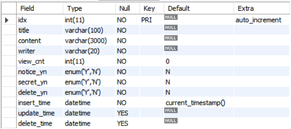
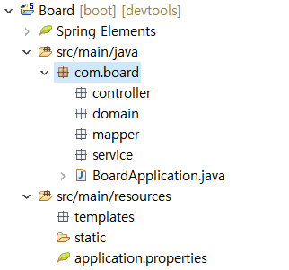
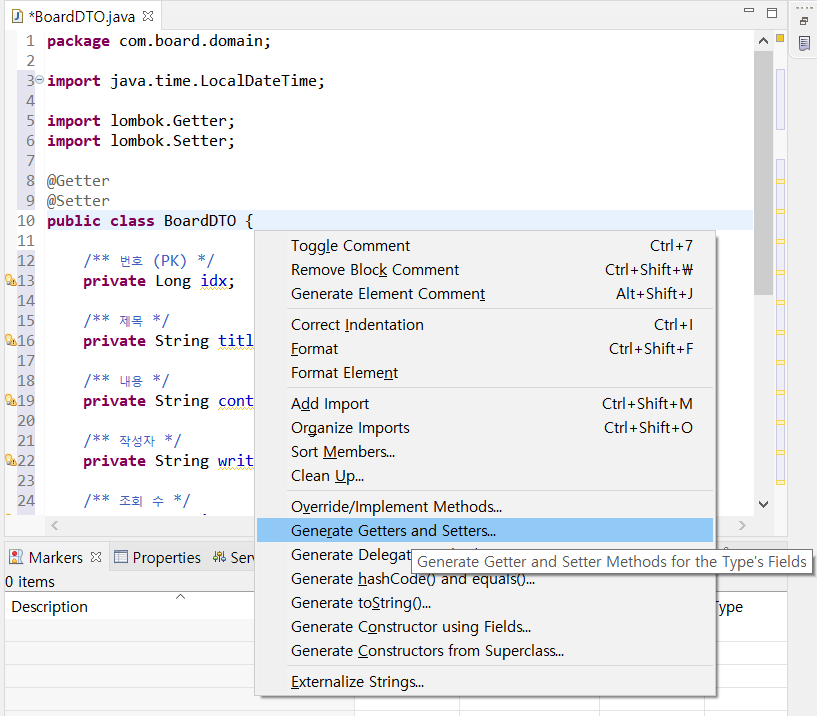
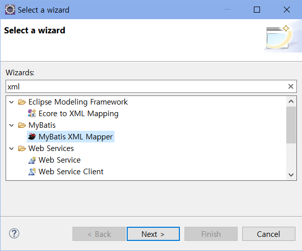

# [Spring Boot 게시판 - 03. 게시판 CRUD 처리]


### CRUD란? 

- Create(생성)
- Read(조회)
- Update(수정)
- Delete(삭제)


---

### 1. 게시판 테이블 생성

데이터베이스에 게시글을 관리할 게시판 테이블 생성

```sql
CREATE TABLE tb_board (
    idx INT NOT NULL AUTO_INCREMENT COMMENT '번호 (PK)',
    title VARCHAR(100) NOT NULL COMMENT '제목',
    content VARCHAR(3000) NOT NULL COMMENT '내용',
    writer VARCHAR(20) NOT NULL COMMENT '작성자',
    view_cnt INT NOT NULL DEFAULT 0 COMMENT '조회 수',
    notice_yn ENUM('Y', 'N') NOT NULL DEFAULT 'N' COMMENT '공지글 여부',
    secret_yn ENUM('Y', 'N') NOT NULL DEFAULT 'N' COMMENT '비밀글 여부',
    delete_yn ENUM('Y', 'N') NOT NULL DEFAULT 'N' COMMENT '삭제 여부',
    insert_time DATETIME NOT NULL DEFAULT NOW() COMMENT '등록일',
    update_time DATETIME NULL COMMENT '수정일',
    delete_time DATETIME NULL COMMENT '삭제일',
    PRIMARY KEY (idx)
)  COMMENT '게시판';
```


- 테이블 생성 결과 확인

  ```sql
  DESC tb_board; 
  SHOW TABLES;
  ```

  

<br>

---

### 2. 도메인 클래스 생성

- 게시판 테이블의 구조화 역할을 하는 클래스 생성하기
- 보통, 테이블 구조화 클래스는 xxxVO 또는 xxxDTO로 네이밍한다.
  - VO: Read Only(읽기 전용)
  - DTO: 입력받은 데이터의 저장 및 전송 의미


- com.board 에 controller, domain, mapper, service 패키지 추가



<br>

- domain 패키지에 BoardDTO 클래스 추가

  - 방법1. 롬복(Lombok) 라이브러리를 이용하여 추가
  - 방법2. 기존의 방식대로 getter/setter를 추가
    - Alt+Shift+S 키 입력 - Generate Getters and Setters 활용하면 모든 멤버 변수에 대한 getter/setter 쉽게 생성 가능
    <br>
    <details>
        <summary> BoardDTO.java 코드 더보기</summary>
        <div markdown="1">

	  ```java
	  package com.board.domain;

	  import java.time.LocalDateTime;

	  import lombok.Getter;
	  import lombok.Setter;

	  @Getter
	  @Setter
	  public class BoardDTO {

		/** 번호 (PK) */
		private Long idx;

		/** 제목 */
		private String title;

		/** 내용 */
		private String content;

		/** 작성자 */
		private String writer;

		/** 조회 수 */
		private int viewCnt;

		/** 공지 여부 */
		private String noticeYn;

		/** 비밀 여부 */
		private String secretYn;

		/** 삭제 여부 */
		private String deleteYn;

		/** 등록일 */
		private LocalDateTime insertTime;

		/** 수정일 */
		private LocalDateTime updateTime;

		/** 삭제일 */
		private LocalDateTime deleteTime;
	  }
	  ```
  
  </div></details>
  
  


<br>

---

### 3. Mapper 인터페이스 생성

- Mapper 패키지 - BoardMapper 인터페이스 생성

  ```java
  package com.board.mapper;
  
  import java.util.List;
  import org.apache.ibatis.annotations.Mapper;
  import com.board.domain.BoardDTO;
  
  @Mapper
  public interface BoardMapper {
  	public int insertBoard(BoardDTO params);
  	public BoardDTO selectBoardDetail(Long idx);
  	public int updateBoard(BoardDTO params);
  	public int deleteBoard(Long idx);
  	public List<BoardDTO> selectBoardList();
  	public int selectBoardTotalCount();
  }
  ```

  

  | annotation and method | 설명                                                         |
  | --------------------- | ------------------------------------------------------------ |
  | @Mapper               | 마이바티스는 인터페이스에 @Mapper만 지정해주면 XML Mapper에서 메서드의 이름과 일치하는 SQL 문을 찾아 실행<br />Mapper 영역은 데이터베이스와의 통신, 즉 SQL 쿼리를 호출하는 것이 전부이며, 다른 로직은 전혀 필요하지 않다. |
  | insertBoard           | 게시글을 생성하는 INSERT 쿼리를 호출하는 메서드<br />파라미터로는 BoardDTO 클래스가 params라는 이름으로 지정되었고, params에는 게시글의 정보가 담기게 된다. |
  | selectBoardDetail     | 하나의 게시글을 조회하는 SELECT 쿼리를 호출하는 메서드<br />SELECT 쿼리가 실행되면, 각 컬럼에 해당하는 결괏값이 리턴 타입으로 지정된 BoardDTO 클래스의 멤버 변수에 매핑된다. <br />파라미터로는 게시글 번호(idx), 즉 PK를 전달받으며, WHERE 조건으로 idx를 사용해서 특정 게시글을 조회한다. |
  | updateBoard           | 게시글을 수정하는 UPDATE 쿼리를 호출하는 메서드<br />파라미터로는 BoardDTO 클래스가 params라는 이름으로 지정되었고, insertBoard 메서드와 마찬가지로 params에는 게시글의 정보가 담기게 됩니다. |
  | deleteBoard           | 게시글을 삭제하는 DELETE 쿼리를 호출하는 메서드<br />파라미터로는 게시글 조회와 마찬가지로 게시글 번호(idx)를 전달받으며, WHERE 조건으로 idx를 사용해서 특정 게시글을 삭제(상태 값 변경)한다. |
  | selectBoardList       | 게시글 목록을 조회하는 SELECT 쿼리를 호출하는 메서드<br />리턴 타입으로 지정된 List<BoardDTO>와 같이 "< >" 안에 타입을 파라미터로 갖는 형태를 제네릭 타입이라고 하는데요, 쉽게 이야기하면, 리스트 안에 하나의 게시글을 조회하는 selectBoardDetail 메서드를 호출한 결과를 여러 개 저장하는 것과 유사하다. |
  | selectBoardTotalCount | 삭제 여부(delete_yn)가 'N'으로 지정된 게시글의 개수를 조회하는 SELECT 쿼리를 호출하는 메서드<br />나중에 페이징 처리를 진행하면서 사용된다. |

  <br>

---

### 4. 마이바티스 XML Mapper 생성

- src/main/resources - mappers 폴더 생성 - BoardMapper.xml 파일 추가

  - 기본 XML 파일을 생성하여도 무관
  - MyBatis XML Mapper 파일 사용 - MyBatis 플러그인을 설치해야 보이는 파일 
  - 짧은 시간 내에 플러그인의 설치가 가능하며, 자동완성 기능을 지원받을 수 있다는 장점

  


<br>
<details>
    <summary> BoardMapper.xml 코드 더보기</summary>
    <div markdown="1">

```xml
<?xml version="1.0" encoding="UTF-8"?>
<!DOCTYPE mapper PUBLIC "-//mybatis.org//DTD Mapper 3.0//EN" "http://mybatis.org/dtd/mybatis-3-mapper.dtd">

<mapper namespace="com.board.mapper.BoardMapper">
	<sql id="boardColumns">
		  idx
		, title
		, content
		, writer
		, view_cnt
		, notice_yn
		, secret_yn
		, delete_yn
		, insert_time
		, update_time
		, delete_time
	</sql>

	<insert id="insertBoard" parameterType="BoardDTO">
		INSERT INTO tb_board (
			<include refid="boardColumns" />
		) VALUES (
			  #{idx}
			, #{title}
			, #{content}
			, #{writer}
			, 0
			, IFNULL(#{noticeYn}, 'N')
			, IFNULL(#{secretYn}, 'N')
			, 'N'
			, NOW()
			, NULL
			, NULL
		)
	</insert>

	<select id="selectBoardDetail" parameterType="long" resultType="BoardDTO">
		SELECT
			<include refid="boardColumns" />
		FROM
			tb_board
		WHERE
			delete_yn = 'N'
		AND
			idx = #{idx}
	</select>

	<update id="updateBoard" parameterType="BoardDTO">
		UPDATE tb_board
		SET
			  update_time = NOW()
			, title = #{title}
			, content = #{content}
			, writer = #{writer}
			, notice_yn = IFNULL(#{noticeYn}, 'N')
			, secret_yn = IFNULL(#{secretYn}, 'N')
		WHERE
			idx = #{idx}
	</update>

	<update id="deleteBoard" parameterType="long">
		UPDATE tb_board
		SET
			  delete_yn = 'Y'
			, delete_time = NOW()
		WHERE
			idx = #{idx}
	</update>

	<select id="selectBoardList" parameterType="BoardDTO" resultType="BoardDTO">
		SELECT
			<include refid="boardColumns" />
		FROM
			tb_board
		WHERE
			delete_yn = 'N'
		ORDER BY
			notice_yn ASC,
			idx DESC,
			insert_time DESC
	</select>

	<select id="selectBoardTotalCount" parameterType="BoardDTO" resultType="int">
		SELECT
			COUNT(*)
		FROM
			tb_board
		WHERE
			delete_yn = 'N'
	</select>

</mapper>
```

</div></details>

| 태그 및 속성    | 설명                                                         |
| --------------- | ------------------------------------------------------------ |
| < mapper >      | 마이바티스에서 SQL 쿼리 문이 정의되어 있는 파일을 XML Mapper라 한다. 태그의 시작과 끝 사이에는 쿼리 문과 관련된 여러 개의 태그가 존재한다. <br />네임스페이스(namespace) 속성<br />  - < mapper > 태그를 여는 부분에 지정<br />  - BoardMapper 인터페이스의 경로가 지정<br />  - XML Mapper의 SQL 쿼리 문과 Mapper 인터페이스의 메서드를 매핑하기 위해 지정하는 속성 |
| < sql >         | 마이바티스는 < sql > 태그를 이용해서 태그의 시작과 끝 사이에 공통으로 사용되거나, 반복적으로 사용되는 SQL 조각을 정의할 수 있다.<br />예를 들어, SELECT 절에 애스터리스크("*")를 지정해서 전체 컬럼을 조회할 수 있지만, 서브 쿼리나 조인을 이용하면, 컬럼을 일일이 SELECT 절에 지정해야 하는 경우가 발생한다. 만약 컬럼이 30개라면 30개의 컬럼을 일일이 SELECT 절에 지정해야 하고, 예기치 못하게 테이블의 컬럼 구조가 변경된다면, 변경될 때마다 XML Mapper를 수정해야 한다.<br />우리는 이러한 문제를 사전에 방지하고, 더욱 효율적으로 SQL 문을 처리할 수 있도록 게시판 테이블의 전체 컬럼을 SQL 조각으로 정의해서 boardColumns라는 이름으로 사용한다. |
| < include >     | < sql > 태그에 정의한 boardColumns SQL 조각의 인클루드에 사용되는 태그 |
| parameterType   | 쿼리의 실행에 필요한 파라미터의 타입을 해당 속성에 지정한다. |
| resultType      | 쿼리의 실행 결과를 매핑할 타입을 지정한다.                   |
| 파라미터 표현식 | 전달받은 파라미터는 #{ } 표현식을 사용해서 처리한다.         |

<br>

---

### 5. 마이바티스 SELECT 컬럼과 DTO 멤버변수 매핑

- 마이바티스의 SELECT 쿼리의 결과 컬럼은 DTO 클래스의 멤버변수와 매핑된다. 

- 그러나, XML Mapper의 SQL은 언더바(_)로 연결하는 **스네이크 케이스**를 사용하고, 자바에서는 **카멜 케이스**를 사용한다. 

- 이러한 경우, 마이바티스의 map-underscore-to-camel-case 설정을 사용하면 자동 매핑이 가능하다. 

- application.properties 하단에 다음 내용을 추가한다.

  ```properties
  #MyBatis
  mybatis.configuration.map-underscore-to-camel-case=true
  ```

<br>

---

### 6. DBConfiguration 클래스 처리

- application.properties에 마이바티스 설정이 추가되었기 때문에, 해당 설정을 처리할 빈(Bean)을 정의해줘야 한다. 

- DBConfiguration 클래스를 다음과 같이 변경해주자.
<br>
  <details>
      <summary> DBConfiguration.java 코드 더보기</summary>
      <div markdown="1">

  ```java
  package com.board.configuration;
  
  import javax.sql.DataSource;
  
  import org.apache.ibatis.session.SqlSessionFactory;
  import org.mybatis.spring.SqlSessionFactoryBean;
  import org.mybatis.spring.SqlSessionTemplate;
  import org.springframework.beans.factory.annotation.Autowired;
  import org.springframework.boot.context.properties.ConfigurationProperties;
  import org.springframework.context.ApplicationContext;
  import org.springframework.context.annotation.Bean;
  import org.springframework.context.annotation.Configuration;
  import org.springframework.context.annotation.PropertySource;
  
  import com.zaxxer.hikari.HikariConfig;
  import com.zaxxer.hikari.HikariDataSource;
  
  @Configuration
  @PropertySource("classpath:/application.properties")
  public class DBConfiguration {
  
  	@Autowired
  	private ApplicationContext applicationContext;
  
  	@Bean
  	@ConfigurationProperties(prefix = "spring.datasource.hikari")
  	public HikariConfig hikariConfig() {
  		return new HikariConfig();
  	}
  
  	@Bean
  	public DataSource dataSource() {
  		return new HikariDataSource(hikariConfig());
  	}
  
  	@Bean
  	public SqlSessionFactory sqlSessionFactory() throws Exception {
  		SqlSessionFactoryBean factoryBean = new SqlSessionFactoryBean();
  		factoryBean.setDataSource(dataSource());
  		factoryBean.setMapperLocations(applicationContext.getResources("classpath:/mappers/**/*Mapper.xml"));
  		factoryBean.setTypeAliasesPackage("com.board.domain");
  		factoryBean.setConfiguration(mybatisConfg());
  		return factoryBean.getObject();
  	}
  
  	@Bean
  	public SqlSessionTemplate sqlSession() throws Exception {
  		return new SqlSessionTemplate(sqlSessionFactory());
  	}
  
  	@Bean
  	@ConfigurationProperties(prefix = "mybatis.configuration")
  	public org.apache.ibatis.session.Configuration mybatisConfg() {
  		return new org.apache.ibatis.session.Configuration();
  	}
  
  }
  ```

  </div></details>

  | 메서드                | 설명                                                         |
  | --------------------- | ------------------------------------------------------------ |
  | setMapperLocations    | 해당 메서드는 getResources 메서드의 인자로 지정된 패턴에 포함되는 XML Mapper를 인식하도록 하는 역할 <br />기존에는 XML Mapper가 없었지만, 앞에서 BoardMapper XML이 추가되었기에 해당 파일을 인식할 수 있도록 주석이 해제되었다. |
  | setTypeAliasesPackage | BoardMapper XML에서 parameterType과 resultType은 클래스의 풀 패키지 경로가 포함되어야 한다.<br />우리는 BoardDTO와 같이 클래스의 이름만 지정하였는데, 해당 메서드를 사용해서 풀 패키지 경로를 생략할 수 있다.<br />패키지의 패턴이 복잡하다면, com.board. .domain과 같이 전체를 의미하는 애스터리스크("*")를 지정할 수 있다. |
  | mybatisConfig         | application.properties에서 mybatis.configuration으로 시작하는 모든 설정을 읽어 들여 빈(Bean)으로 등록한다. |
  | setConfiguration      | 마이바티스 설정과 관련된 빈(Bean)을 설정 파일로 지정한다.    |
