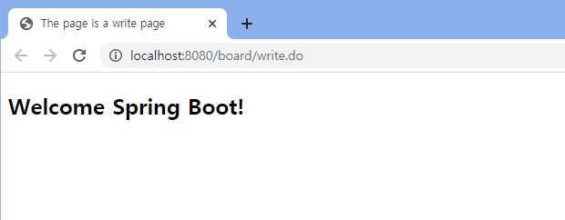
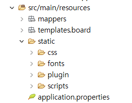
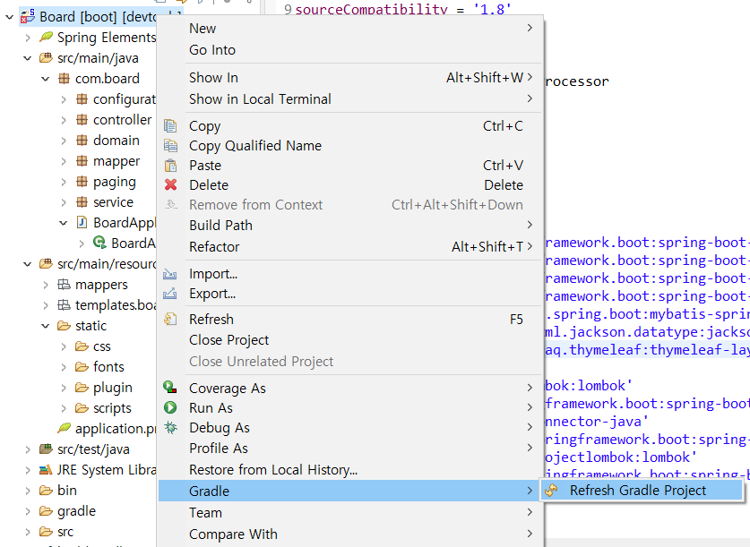
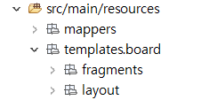

# [Spring Boot 게시판 - 04. 게시글 등록(Create) 처리]


### 진행 목표

- 비즈니스 로직을 담당하는 Service 기능
- 사용자가 보는 화면을 의미하는 UI (View 영역)
- Model과 View 영역을 연결해주는 Controller 영역 처리

---

### 1. Service 처리

- Mapper 영역의 처리를 완료 후 Service 영역 진행

- BoardService 인터페이스 생성 

  ```java
  package com.board.service;
  import java.util.List;
  import com.board.domain.BoardDTO;
  
  public interface BoardService {
  	public boolean registerBoard(BoardDTO params);
  	public BoardDTO getBoardDetail(Long idx);
  	public boolean deleteBoard(Long idx);
  	public List<BoardDTO> getBoardList();
  }
  ```

  <br>

- com.board.service - BoardService - BoardServiceImpl 클래스 생성

<details>
<summary> BoardServiceImpl 코드 보기</summary>
<div markdown="1">

```java
package com.board.service;

import java.util.Collections;
import java.util.List;

import org.springframework.beans.factory.annotation.Autowired;
import org.springframework.stereotype.Service;

import com.board.domain.BoardDTO;
import com.board.mapper.BoardMapper;

@Service
public class BoardServiceImpl implements BoardService {

	@Autowired
	private BoardMapper boardMapper;

	@Override
	public boolean registerBoard(BoardDTO params) {
		int queryResult = 0;

		if (params.getIdx() == null) {
			queryResult = boardMapper.insertBoard(params);
		} else {
			queryResult = boardMapper.updateBoard(params);
		}

		return (queryResult == 1) ? true : false;
	}

	@Override
	public BoardDTO getBoardDetail(Long idx) {
		return boardMapper.selectBoardDetail(idx);
	}

	@Override
	public boolean deleteBoard(Long idx) {
		int queryResult = 0;

		BoardDTO board = boardMapper.selectBoardDetail(idx);

		if (board != null && "N".equals(board.getDeleteYn())) {
			queryResult = boardMapper.deleteBoard(idx);
		}

		return (queryResult == 1) ? true : false;
	}

	@Override
	public List<BoardDTO> getBoardList() {
		List<BoardDTO> boardList = Collections.emptyList();

		int boardTotalCount = boardMapper.selectBoardTotalCount();

		if (boardTotalCount > 0) {
			boardList = boardMapper.selectBoardList();
		}

		return boardList;
	}

}
```

</div></details>

  <details>
    <summary> BoardServiceImpl 코드 설명 보기</summary>
      <div markdown="1">

| 메서드 및 기타 | 설명                                                         |
| -------------- | ------------------------------------------------------------ |
| @Service       | BoardMapper 인터페이스의 @Mapper와 유사한 역할<br />해당 클래스가 비즈니스 로직을 담당하는 서비스 클래스임을 의미 |
| implements     | BoardService 인터페이스에 정의한 메서드를 구현하기 위해 BoardService를 상속받음(인터페이스와 구현 클래스 구분하여 처리하는 것) |
| boardMapper    | @Autowired를 이용해서 BoardMapper 인터페이스 빈(Bean)을 주입 |
| registerBoard  | 게시글 생성(Insert)과 수정(Update) 두 가지 모두 데이터를 등록하는 행위이기 때문에, 두 개의 메서드로 나누어 처리하지 않고 게시글 번호(idx)의 유무를 기준으로 insert 또는 update를 실행하며, 로직은 다음과 같다.<br />1. queryResult 변수에 insertBoard 또는 updateBoard 메서드의 실행 결과를 저장한다. 각 메서드에서 호출한 쿼리가 정상적으로 실행되면 쿼리를 실행한 횟수가 저장된다.<br />2. params의 idx가 null이면 MySQL의 AUTO_INCREMENT 속성에 의해 PX(idx)가 자동 증가되어 게시글을 생성하고, idx가 포함되어 있으면 게시글을 수정한다.<br />3. return문에서는 쿼리의 실행결과를 기준으로 true/false를 반환한다. |
| getBoardDetail | 하나의 게시글을 조회하는 selectBoardDetail 메서드와 게시글의 조회수를 증가시키는 로직을 포함한다. |
| deleteBoard    | 특정 게시글을 조회하고, 사용 중인 상태의 게시글인 경우만 게시글을 삭제한다. 없는 게시글이거나, 삭제 여부(delete_yn) 컬럼의 상태 값이 'Y'인 경우에는 삭제가 실행되지 않으며, registerBoard 메서드와 마찬가지로 쿼리의 실행 결과를 기준으로 true 또는 false를 반환한다. |
| getBoardList   | 삭제되지 않은 전체 게시글 조회<br />1. boardList: NPE 방지를 위해 Collections 클래스의 emptyList 메서드를 이용해서 비어있는 리스트를 선언<br />2. boardTotalCount: 삭제되지 않은(사용 중인) 전체 게시글 수를 카운팅 한 결과를 저장<br />3. if문: 사용 중인 전체 게시글이 1개 이상이면 boardList에 selectBoardList 메서드의 결과를 반환한다. |

</div></details>

잘 되었는지 확인하기 위해서는 Mapper 영역의 테스트처럼 

src/test/java - com.board - ServiceTests 클래스 생성해서 테스트가 가능하다.

<br>

---

### 2. Controller 처리

- Controller: 사용자가 보는 화면(User Interface) 담당

- com.board.controller - BoardController 클래스 생성

  ```java
  package com.board.controller;
  
  import org.springframework.beans.factory.annotation.Autowired;
  import org.springframework.stereotype.Controller;
  import org.springframework.ui.Model;
  import org.springframework.web.bind.annotation.GetMapping;
  
  import com.board.service.BoardService;
  
  @Controller
  public class BoardController {
  
  	@Autowired
  	private BoardService boardService;
  
  	@GetMapping(value = "/board/write.do")
  	public String openBoardWrite(Model model) {
  		return "board/write";
  	}
  }
  ```

  | 구성 요소   | 설명                                                         |
  | ----------- | ------------------------------------------------------------ |
  | @Controller | 해당 클래스가 사용자의 요청과 응답을 처리하는(UI를 담당하는) 컨트롤러 클래스임을 의미 |
  | Model       | 메서드의 파라미터로 저장된 Model 인터페이스는 데이터를 View로 전달하는 데 사용된다. |


<br>

---

### 3. 화면 처리하기

Controller의 처리가 완료되면, 메서드의 return 타입으로 지정된 경로에 화면(html)을 생성해야 한다. 

- src/main/resources - templates - board 폴더 추가

- write.html 추가

  ```html
  <!DOCTYPE html>
  <html>
  	<head>
  		<meta charset="UTF-8">
  		<title>The page is a write page</title>
  	</head>
  	<body>
  		<h2>Welcome Spring Boot!</h2>
  	</body>
  </html>
  ```

  - write.html에 실행 내용 넣고, 실행 후 http://localhost:8080/board/write.do 로 접속하면, write.html에 해당하는 화면이 출력된다. 

  

<br>

- 컨트롤러에서 화면(html)로 데이터 전달하는데 사용되는 Model 인터페이스

- openBoardWrite 메서드를 다음과 같이 변경한다. 

  ```java
  	@GetMapping(value = "/board/write.do")
  	public String openBoardWrite(Model model) {
  
  		String title = "제목";
  		String content = "내용";
  		String writer = "홍길동";
  
  		model.addAttribute("t", title);
  		model.addAttribute("c", content);
  		model.addAttribute("w", writer);
  
  		return "board/write";
  	}
  ```

  - addAttribute 메서드
    - 해당 메서드를 이용해서 화면으로 데이터 전달할 수 있다. 
    - 메서드의 인자로는 이름, 값을 전달한다. (보통 이름과 값 동일하게 지정)
    - HTML에서는 ${} 표현식을 이용하여 전달받은 데이터에 접근 가능

  <br>

타임리프를 이용하여 전달받은 데이터를 화면에 출력하자.

- write.html 수정

  ```html
  <!DOCTYPE html>
  <html lang="ko" xmlns:th="http://www.thymeleaf.org">
  	<head>
  		<meta charset="UTF-8">
  		<title>The page is a write page</title>
  	</head>
  	<body>
  		<h2>Welcome Spring Boot!</h2>
  		<span th:text="${t}">여기는 제목입니다.</span>
  		<span th:text="${c}">여기는 내용입니다.</span>
  		<span th:text="${w}">여기는 작성자입니다.</span>
  	</body>
  </html>
  ```

  - `xmlns:th`
    - 타임리프의 th 속성을 사용하기 위해 선언된 네임스페이스
    - 순수 html로만 이루어진 경우, 선언하지 않아도 무관하다.
  - `th:text`
    - JSP의 ${}와 마찬가지로 타임리프로 ${} 표현식을 이용


다시 실행한 후, http://localhost:8080/board/write.do 로 접속하면 컨트롤러에서 전달받은 값이 출력되는 것을 확인할 수 있다. 


---

### 4. 부트스트랩(Bootstrap) 적용

- Bootstrap

  - 화면을 꾸미기 위한 기능
  - UI를 쉽고 빠르게 구성할 수 있도록 도와주는 HTML, CSS, JS 프레임워크

- [static.zip](https://github.com/sanga327/Spring-boot-board/tree/main/bootstrap) 파일을 다운로드하고, 압축을 해제한 후, src/main/resources - static 폴더에 추가한다. 

  


- 화면에서 공통으로 사용할 레이아웃(layout), 글쓰기 페이지, 게시글 상세 페이지, 게시글 리스트 페이지에 공통으로 적용되는 머리(header)와 몸통(body)를 만들어 보도록 하자. 

  - 타임리프 레이아웃 기능을 이용하려면 라이브러리를 추가해줘야 한다. 

  - build.gradle - dependencies에 다음을 추가해준다. 

  - 코드의 선언 위치는 implementation끼리 모아두어야 한다. 

    ```java
    implementation 'nz.net.ultraq.thymeleaf:thymeleaf-layout-dialect' /* Thymeleaf Layout */
    ```

    

<br>

- 프로젝트에 라이브러리 적용하기 위해 Gradle - Refresh Gradle Project 실행

  

<br>

- 헤더(header)와 바디(body)를 만들어 보자. 

- src/main/resources - templates/board - fragments와 layout 폴더 추가

  

- fragments 폴더에 header.html, body.html 추가

- header.html 작성

  ```html
  <!DOCTYPE html>
  <html lang="ko" xmlns:th="http://www.thymeleaf.org" xmlns:layout="http://www.ultraq.net.nz/thymeleaf/layout">
  	<head th:fragment="main-head">
  		<meta http-equiv="Content-Type" content="text/html; charset=UTF-8">
  		<meta http-equiv="X-UA-Compatible" content="IE=edge">
  		<meta name="viewport" content="width=device-width, initial-scale=1, user-scalable=no">
  		<meta name="description" content="">
  		<meta name="author" content="">
  
  		<th:block layout:fragment="title"></th:block>
  
  		<link rel="stylesheet" th:href="@{/css/style.css}" />
  		<link rel="stylesheet" th:href="@{/plugin/mCustomScrollbar/jquery.mCustomScrollbar.min.css}" />
  
  		<th:block layout:fragment="add-css"></th:block>
  	</head>
  </html>
  ```

  - `th:fragment`: < head > 태그에 해당 속성을 사용하여 fragment의 이름을 지정한다. 
    - 다른 html에서 include 또는 replace 속성을 사용해서 적용 가능

  - `th:block`: layout:fragment 속성에 이름을 지정하여 실제 Content 페이지의 내용을 채우는 기능
    - 동적인 처리가 필요할 때 사용
  - `th:href`: < a > 태그의 href 속성과 동일하며, JSTL의 < c:url > 태그와 마찬가지로 웹 어플리케이션을 구분하는 콘텍스트 경로(Context Path)를 포함한다. 
    - application.properties에서 콘텍스트 경로(Context Path)를 원하는 경로로 변경할 수 있다. 

<br>

- body.html 작성

<details>
    <summary> body.html 코드 보기</summary>
    <div markdown="1">

```html
<!DOCTYPE html>
<html lang="ko" xmlns:th="http://www.thymeleaf.org" xmlns:layout="http://www.ultraq.net.nz/thymeleaf/layout">
	<body th:fragment="main-body">
		<div class="fixed-navbar">
			<div class="pull-left">
				<h1 class="page-title">Board</h1>
			</div>
		</div>
		<!-- /.fixed-navbar -->

		<div id="wrapper">
			<div class="main-content">
				<div class="row row-inline-block small-spacing">
					<div class="col-xs-12">
						<div class="box-content">
							<div class="clearfix">
								<h4 class="box-title pull-left"></h4>
								<!-- /.box-title -->
	
								<th:block layout:fragment="search"></th:block>
	
							</div>
							<!-- //.clearfix -->
	
							<th:block layout:fragment="content"></th:block>
	
							<th:block layout:fragment="paging"></th:block>
						</div>
						<!-- /.box-content -->
						
						<th:block layout:fragment="add-content"></th:block>

					</div>
					<!-- /.col-xs-12 -->
				</div>
				<!-- /.row row-inline-block small-spacing -->
				<footer class="footer">
					<ul class="list-inline">
						<li>2016 © NinjaAdmin.</li>
					</ul>
				</footer>
			</div>
			<!-- /.main-content -->
		</div>
		<!-- /#wrapper -->

		<script th:src="@{/scripts/jquery.min.js}"></script>
		<script th:src="@{/plugin/bootstrap/js/bootstrap.min.js}"></script>
		<script th:src="@{/plugin/mCustomScrollbar/jquery.mCustomScrollbar.concat.min.js}"></script>

		<script th:src="@{/scripts/main.js}"></script>
		<script th:src="@{/scripts/common.js}"></script>

		<th:block layout:fragment="script"></th:block>
	</body>
</html>
```

</div></details>

- body.html 코드 해석

  - search: 게시글 리스트 페이지의 검색 영역

  - content: 실제 content가 들어가는 영역
  - paging: 게시글 리스트 페이지 하단의 페이지네이션 영역
  - add-content: 추가되는 content가 들어가는 영역 (댓글 처리시 사용)

<br>

이제 글쓰기 페이지에 헤더(header)와 푸터(footer)를 적용해보자. 

- write.html 변경

  ```html
  <!DOCTYPE html>
  <html lang="ko" xmlns="http://www.w3.org/1999/xhtml" xmlns:th="http://www.thymeleaf.org">
  	<head th:replace="board/fragments/header :: main-head"> </head>
  	<body th:replace="board/fragments/body :: main-body"> </body>
  </html>
  ```

  - `th:replace`: JSP의 < include > 태그와 유사한 속성으로, templates/board 폴더에서 header.html의 main-head 프래그먼트와 body.html의 main-body 프래그먼트를 찾아 해당 코드로 치환한다. 

- 이 상태에서 http://localhost:8080/board/write.do로 접속하면 게시판 부분이 비어있는 창이 나온다. 


<br>

- 헤더(header)와 푸터(footer)는 게시판의 모든 페이지에서 공통으로 사용되기 때문에 레이아웃으로 처리되어야 하며, 레이아웃을 인클루드하는 방법을 알아보자. 
- layout 폴더 - basic.html 추가
- write.html 코드 그대로 입력해주기

- write.html 은 다음과 같이 변경(레이아웃 폴더에 추가된 basic.html을 인클루드 하도록)

  ```html
  <!DOCTYPE html>
  <html lang="ko" xmlns:th="http://www.thymeleaf.org" xmlns:layout="http://www.ultraq.net.nz/thymeleaf/layout" layout:decorator="board/layout/basic">
  	<th:block layout:fragment="title">
  		<title>The page is a write page</title>
  	</th:block>
  </html>
  ```

  - `xmlns:th`: 타임리프의 th속성을 사용하기 위한 선언
  - `xmlns:layout`: 타임리프의 레이아웃 기능을 사용하기 위한 선언
  - `xmlnlayout:decorator`: 레이아웃으로 basic.html을 사용하겠다는 의미
  - `th:block layout:fragment`: header.html을 작성하는 과정에서 이야기했듯, layout:fragment 속성에 이름을 지정해서 실제 Content 페이지의 내용 채우기
    - 예를 들어, 글쓰기 페이지는 write, 리스트 페이지는 list 등으로 페이지마다 타이틀 다르게 처리


<br>

- 다음으로 게시글 등록 화면을 처리하자.

- BoardController의 openBoardWrite 메서드를 다음과 같이 변경

  ```java
  	@GetMapping(value = "/board/write.do")
  	public String openBoardWrite(@RequestParam(value = "idx", required = false) Long idx, Model model) {
  		if (idx == null) {
  			model.addAttribute("board", new BoardDTO());
  		} else {
  			BoardDTO board = boardService.getBoardDetail(idx);
  			if (board == null) {
  				return "redirect:/board/list.do";
  			}
  			model.addAttribute("board", board);
  		}
  		return "board/write";
  	}
  ```

  - `@RequestParam`: View(화면)에서 전달받은 파라미터를 처리하는데 사용됨

<br>

- 다음으로 글쓰기 페이지에 글을 작성할 수 있는 영역을 만들어 보자. (Content 영역)
- write.html 변경

<details>
	<summary> write.html 코드 보기</summary>
	<div markdown="1">

```html
<!DOCTYPE html>
<html lang="ko" xmlns:th="http://www.thymeleaf.org" xmlns:layout="http://www.ultraq.net.nz/thymeleaf/layout" layout:decorator="board/layout/basic">
	<th:block layout:fragment="title">
		<title>thiThe page is a write page</title>
	</th:block>

	<th:block layout:fragment="content">
		<div class="card-content">
			<form class="form-horizontal" th:action="@{/board/register.do}" th:object="${board}" method="post" onsubmit="return registerBoard(this)">
				<!--/* update의 경우 서버로 전달할 게시글 번호 (PK) */-->
				<input type="hidden" th:if="*{idx != null and idx > 0}" th:field="*{idx}" />

				<div class="form-group">
					<label for="noticeYn" class="col-sm-2 control-label">공지글 설정</label>
					<div class="col-sm-10" style="margin-top: 10px;">
						<input type="checkbox" th:value="*{noticeYn}" id="noticeYn" name="noticeYn" th:checked="*{#strings.equals( noticeYn, 'Y' )}" />
					</div>
				</div>

				<div class="form-group">
					<label for="secretYn" class="col-sm-2 control-label">비밀글 설정</label>
					<div class="col-sm-10" style="margin-top: 10px;">
						<input type="checkbox" th:value="*{secretYn}" id="secretYn" name="secretYn" th:checked="*{#strings.equals( secretYn, 'Y' )}" />
					</div>
				</div>

				<div class="form-group">
					<label for="title" class="col-sm-2 control-label">제목</label>
					<div class="col-sm-10">
						<input type="text" th:field="*{title}" class="form-control" placeholder="제목을 입력해 주세요." />
					</div>
				</div>

				<div class="form-group">
					<label for="writer" class="col-sm-2 control-label">이름</label>
					<div class="col-sm-10">
						<input type="text" th:field="*{writer}" class="form-control" placeholder="이름을 입력해 주세요." />
					</div>
				</div>

				<div class="form-group">
					<label for="content" class="col-sm-2 control-label">내용</label>
					<div class="col-sm-10">
						<textarea th:field="*{content}" class="form-control" placeholder="내용을 입력해 주세요."></textarea>
					</div>
				</div>

				<div class="btn_wrap text-center">
					<a th:href="@{/board/list.do}" class="btn btn-default waves-effect waves-light">뒤로가기</a>
					<button type="submit" class="btn btn-primary waves-effect waves-light">저장하기</button>
				</div>
			</form>
		</div>
		<!-- /.card-content -->
	</th:block>

	<th:block layout:fragment="script">
		<script th:inline="javascript">
			/*<![CDATA[*/

			function registerBoard(form) {

				form.noticeYn.value = form.noticeYn.checked == false ? 'N' : 'Y';
				form.secretYn.value = form.secretYn.checked == false ? 'N' : 'Y';

				var result = (
						   isValid(form.title, "제목", null, null)
						&& isValid(form.writer, "이름", null, null)
						&& isValid(form.content, "내용", null, null)
				);

				if ( result == false ) {
					return false;
				}
			}
			/*[- end of function -]*/

			/*]]>*/
		</script>
	</th:block>
</html>
```

</div></details>

<details>
	<summary> write.html 코드 설명 보기</summary>
	<div markdown="1">

| 코드                      | 설명                                                         |
| ------------------------- | ------------------------------------------------------------ |
| layout:fragment="content" | - 게시글 등록 페이지는 게시글의 정보를 입할 수 있는 폼이 필요<br />- 게시글 리스트 페이지는 게시글의 정보를 보여주는 테이블이 필요<br />- 즉, 페이지마다 Content 영역의 형태가 다르기 때문에 layout:fragment를 이용 |
| < form > 태그             | - form은 태그 안에 선언되어 있는 < input > 등 사용자 입력 필드의 name값을 기준으로 th:action 속성에 지정된 URI와 매핑된 컨트롤러의 메서드로 폼 데이터를 전달함<br />- method 속성에는 HTTP 요청 메서드(GET, POST)를 지정함<br />    - GET: 데이터의 조회 (ex) SELECT: 특정 게시글 목록 조회<br />    - POST: 데이터의 생성 (ex) INSERT, UPDATE: 게시글의 생성/수정 |
| th:object                 | th:object 속성의 ${board}는 컨트롤러에서 뷰로 전달한 BoardDTO클래스의 객체<br />해당 속성을 이용하면, th:field를 이용하여 HTML 태그에 멤버 변수를 매핑할 수 있음<br />th:field를 이용한 사용자 입력 필드는 id, name, value 속성 값이 자동으로 매핑되기 때문에 각 속성을 따로 지정할 필요가 없으며, th:field는 ${} 표현식이 아니라 *{} 표현식을 사용함 |
| layout:fragment="script"  | 자바스크립트도 페이지마다 로직이 다르기 때문에 layout:fragment를 이용 |
| < ![CDATA[]] >            | 타임리프는 < , > 태그를 엄격하게 검사하기 때문에 자바스크립트 코드는 꼭 CDATA로 묶어줘야 함<br />CDATA는 특수문자를 전부 문자열로 치환할 때 사용 |
| registerBoard 함수        | 폼의 onsubmit 이벤트에 해당 함수를 선언하면서 인자로 this를 전달<br />this는 자기 자신(폼 객체)를 의미<br />자바스크립트 영역의 registerBoard 함수는 전달받은 this를 form이라는 이름의 파라미터로 사용<br />- 함수의 전체 로직<br />    1. noticeYn과 secretYn의 체크 여부에 따라 값을 지정<br />    2. result 변수에 isValid(유효성 검사) 함수를 실행한 결과를 저장<br />        - 제목, 작성자, 내용은 없어서는 안 되는 필수적인 데이터이므로 유효성 검사 필수 |

</div></details>

<br>

- 게시글 등록을 처리하는 메서드 작성

- BoardController의 th:action에 지정

  ```java
  	@PostMapping(value = "/board/register.do")
  	public String registerBoard(final BoardDTO params) {
  		try {
  			boolean isRegistered = boardService.registerBoard(params);
  			if (isRegistered == false) {
  				// TODO => 게시글 등록에 실패하였다는 메시지를 전달
  			}
  		} catch (DataAccessException e) {
  			// TODO => 데이터베이스 처리 과정에 문제가 발생하였다는 메시지를 전달
  
  		} catch (Exception e) {
  			// TODO => 시스템에 문제가 발생하였다는 메시지를 전달
  		}
  		return "redirect:/board/list.do";
  	}
  ```

  | 파라미터 | 설명                                                         |
  | -------- | ------------------------------------------------------------ |
  | params   | "name" 속성값을 통해 폼 데이터를 컨트롤러 메서드의 파라미터로 전송<br />BoardDTO의 멤버 변수명과 사용자 입력 필드의 "name" 속성 값이 동일하면 params의 각 멤버 변수에 "name" 속성 값을 통해 전달된 value가 매핑된다. |


